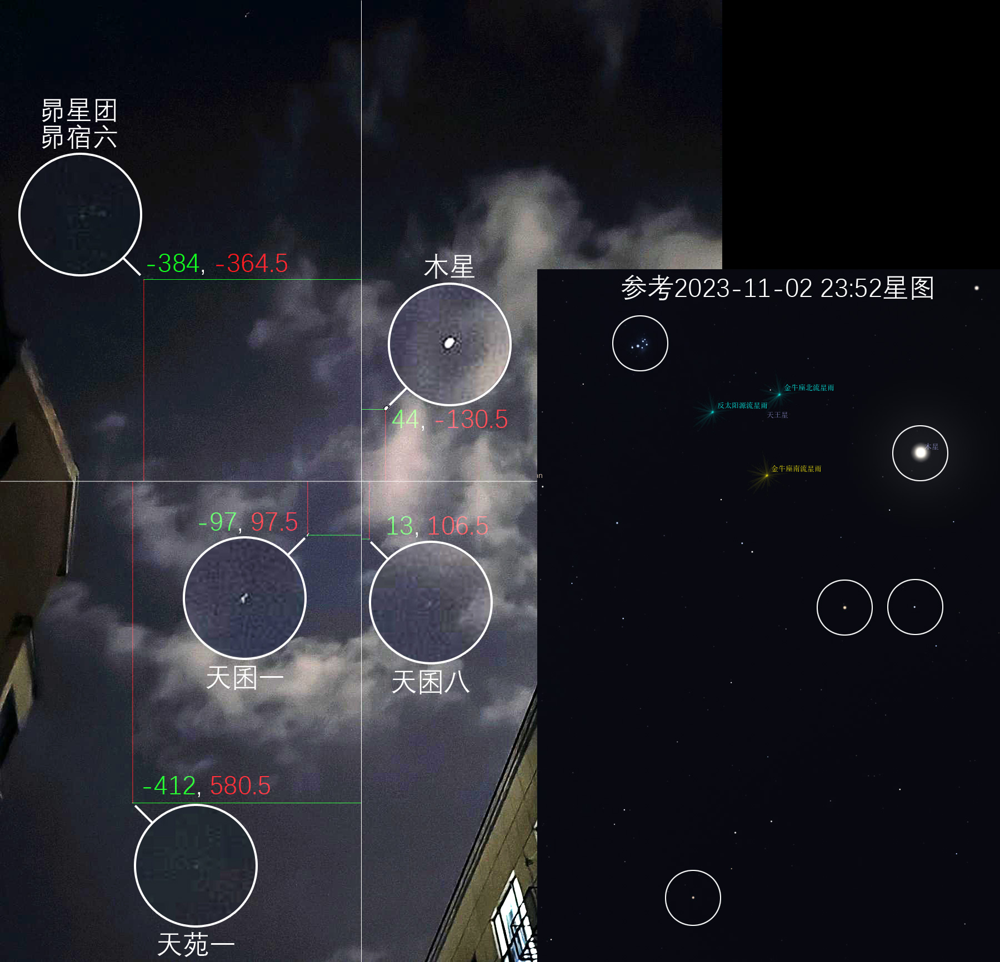
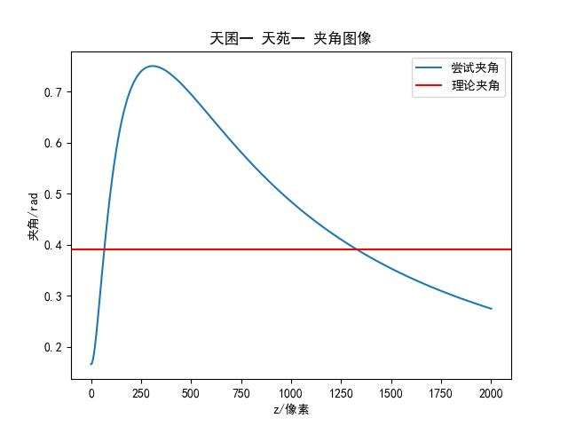

> 我们都是阴沟里的虫子，但总还是得有人仰望星空。
> <p align="right">——刘慈欣</p>

# 照片测星定位

通过一张有至少两颗星星，有地景，已知拍摄时间的照片，计算出拍摄者的位置。

## 本项目作者

[MC着火的冰块](https://space.bilibili.com/551409211)

## 原理

[从一张星空照片定位出拍摄地是真的还是假的？](https://www.bilibili.com/video/BV1Dx4y117yM)

[照片测星定位法原理简介](https://www.bilibili.com/read/cv28301382)

## 使用方法

使用`-h`参数获取帮助：

```commandline
pap -h
pap mark -h
...
```

下面以`examples/1.jpg`为例进行演示（拍摄时间2023-11-02 23:52）。


### 0. 初始化

```commandline
pap init
```

这会创建一个新的`data.json`，之后的数据都会存储在这里。

### 1. 照片上的天体辨识和测量

在照片上标记星星的名字和坐标（以图片**正中心**为原点，向右为x轴正方向，**向下**为y轴正方向）。



在星图软件中查找出**0°,0°处，拍摄时**它们的时角和赤纬。


| 星星  | x    | y      | 时角           | 赤纬           |
|-----|------|--------|--------------|--------------|
| 昴宿六 | -384 | -364.5 | 14h49m44.14s | +24°10'46.5" |
| 木星  | 44   | -130.5 | 16h04m10.53s | +13°39'15.2" |
| 天囷一 | -97  | 97.5   | 15h35m06.71s | +4°11'04.5"  |
| 天囷八 | 13   | 106.5  | 15h54m06.05s | +3°20'16.6"  |
| 天苑一 | -412 | 580.5  | 14h39m29.71s | -13°26'19.1" |

记录完后，运行：

```commandline
pap mark
```

按要求输入数据即可。

或者先将其以**以下格式**整理进一个文件：

```text
昴宿六 -384 -364.5 14h49m44.14s +24°10'46.5"
木星 44 -130.5 16h04m10.53s +13°39'15.2"
天囷一 -97 97.5 15h35m06.71s +4°11'04.5"
天囷八 13 106.5 15h54m06.05s +3°20'16.6"
天苑一 -412 580.5 14h39m29.71s -13°26'19.1"
```

然后运行：

```commandline
pap mark -r examples/stars.txt
```

### 2. 像素焦距

请确保[第一步](#1-照片上的天体辨识和测量)已经完成。

运行：

```commandline
pap z
```

### 3. 天顶位置确定

先将照片中指向天顶的直线用**纯**红色、绿色或蓝色（推荐绿色）标注出来，长度至少50像素。


然后运行：

```commandline
pap zenith examples/lines.jpg --colour=green
```

程序会很快计算出距离这些直线总距离最近的点。

### 4. 定位计算

请确保前3步均已完成。

运行：

```commandline
pap calc
```

然后程序就会输出最终的结果。

## 详细数学原理

这一部分主要是对[照片测星定位法原理简介](https://www.bilibili.com/read/cv28301382)中没有给出的计算过程进行补充说明。

由于作者还没上高中，没有系统地学习过这些内容，所以可能会有错误或不规范的地方，还请大家指正。

这一部分的工程文件在`dev/`下。

**基础知识**

[向量（数学用语）_百度百科](https://baike.baidu.com/item/%E5%90%91%E9%87%8F)

> 在数学中，向量（也称为欧几里得向量、几何向量），指具有大小（magnitude）和方向的量。它可以形象化地表示为带箭头的线段。箭头所指：代表向量的方向；线段长度：代表向量的大小。
>
> 长度为一个单位（即模为1）的向量，叫做单位向量。

在[第一步](#1-照片上的天体辨识和测量)中，我们会得到每颗星星的GP，是一个经纬度，如何转化为向量呢？

记纬度为 $\phi$ ，经度为 $\lambda$ ，星星的单位方向向量为 $\vec{n}$ ，则有：

$$
\vec{n} = \begin{bmatrix}
\cos\phi \cos\lambda & \cos\phi \sin\lambda & \sin\phi
\end{bmatrix}
$$

两个向量的夹角可用以下公式计算：

$$
\theta = \arccos\left(\frac{\vec{a}\cdot\vec{b}}{\left|\vec{a}\right|\left|\vec{b}\right|}\right)
$$

~~什么？向量点乘怎么算？我怎么知道怎么算，我会调用就行了（逃~~

**照片成像原理与像素焦距**

当时间确定时，每颗星星的位置都是确定的。根据GP算出向量，然后就能算出它们的理论夹角。

设像素焦距为 $z$ ，对于一颗在照片上位于 $(x, y)$ 的星星来说，它的尝试向量为：

$$
\begin{bmatrix}
x & y & z
\end{bmatrix}
$$

将两个向量代入公式即可求得尝试夹角。

对于在照片上不同象限中的星星，尝试夹角关于 $z$ 单调递减；
对于同一象限内的星星，增减性大致如下图，其中后一个交点是我们想要的：



任选两颗星星，不断改变 $z$ ，直到尝试夹角与理论夹角可以看作相等了，我们就试出了 $z$ 的值，多次计算取平均值。

这里可以以开始递减的地方为下限，用二分法查找。

（为什么不用公式法？因为方程太过复杂，sympy算6个小时都算不出来）

**天顶位置确定**

[求解离多条直线最近的点 （2D，3D，或任意维度的直线）](https://zhuanlan.zhihu.com/p/146190385)

[Nearest approaches to multiple lines in n-dimensional space](https://www.crewes.org/Documents/ResearchReports/2010/CRR201032.pdf)

我还没看懂，但是他给代码了，所以我就直接用了。

**定位计算**

知道了天顶位置为像素焦距，就能得到天顶向量，星星向量与天顶向量的夹角就是天顶角，天顶角的余角就是高度角。

[法向量_百度百科](https://baike.baidu.com/item/%E6%B3%95%E5%90%91%E9%87%8F)

> 用方程ax+by+cz=d表示的平面，向量(a,b,c)就是其法线。

记星星的高度角为 $\theta$ ，根据专栏中**双星定位法**中的算法，可以求出一颗星星的平面方程为：

$$
x \sin{\left(\theta \right)} \cos{\left(\lambda \right)} \cos{\left(\phi \right)} + y \sin{\left(\lambda \right)}
\sin{\left(\theta \right)} \cos{\left(\phi \right)} + z \sin{\left(\phi \right)} \sin{\left(\theta \right)} =
\sin^{2}{\left(\theta \right)}
$$

将两颗星星的平面方程与地球（单位球）的方程联立：

$$
\begin{cases}
A_{1} x + B_{1} y + C_{1} z = D_{1} \\
A_{2} x + B_{2} y + C_{2} z = D_{2} \\
x^{2} + y^{2} + z^{2} = 1
\end{cases}
$$

解得：


或


然后将这两个空间直角坐标转换为经纬度：

$$
\begin{cases}
\phi = \arcsin z \\
\lambda = \arctan^2\left(y, x\right)
\end{cases}
$$

两两计算，最后筛选出正确的经纬度，取平均值即可。
